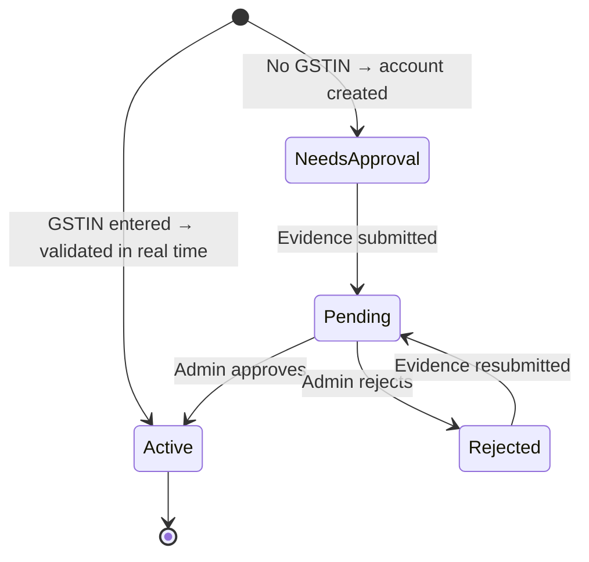
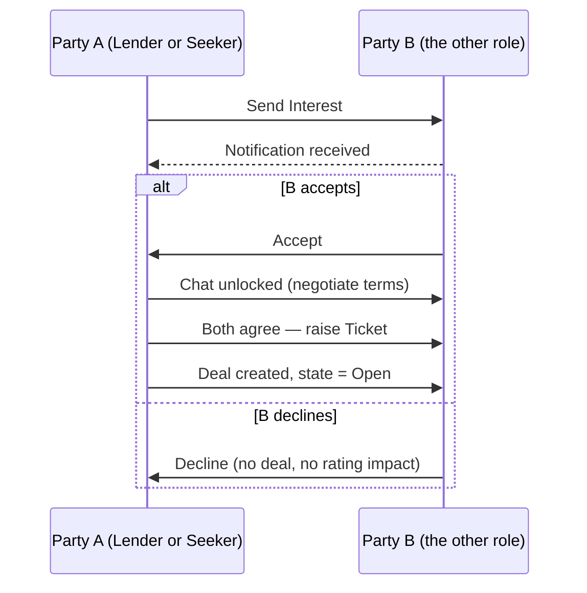
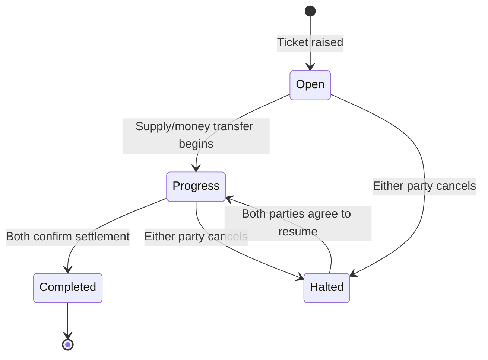

# Saakh — Functional Spec

Sep 25, 2026 · @Sohum

## Overview & Problem Statement

Unorganized small vendors (street/local retail, small wholesalers, informal service providers) build years of trustworthy trading relationships with specific suppliers and financiers, but that trust is completely illiquid — it cannot be shown to a *new* counterparty. A new distributor meeting a vendor for the first time has no fast way to verify reliability, so they either refuse credit, demand collateral, or move slowly — even when the vendor has an excellent track record elsewhere.

This gap persists because it falls between two existing categories of solution, neither of which actually serves it:

- **Formal commercial credit bureaus** (Dun & Bradstreet, Experian, Equifax-style trade references) require a registered business credit file, and most small/informal vendors are never in that system at all.
- **Alternative/lending-facing credit infrastructure** (e.g. OCEN and Account Aggregator-style frameworks in India) scores a vendor so a *bank or NBFC* can decide on a loan — the customer of the score is a lender, not a peer trading partner, and the signals it captures (formal repayment capacity) differ from what a fellow trader actually cares about (do they pay on time under pressure, are they honest about disputes, do they reorder consistently).

No product today gives a vendor a portable, vendor-controlled record of their trading reliability that they can show a *new* trading partner to unlock faster trust and better terms. That is the gap this product fills.

**Name:** Saakh.

## Goals & Non-Goals

**Goals**

1. Let a vendor's trading reliability with existing counterparties become visible and portable to new counterparties.
2. Let two parties discover each other, negotiate, and track a credit-based deal (money or material) end-to-end, from first interest to final settlement.
3. Turn every settled deal into a trust signal (rating) that improves future discovery and negotiating position for reliable vendors.

**Non-Goals (explicitly out of scope)**

- The platform does **not** hold, disburse, guarantee, or move any money or material itself — it is a discovery, agreement-tracking, and trust layer only. All actual transfer of funds or goods happens off-platform, between the two parties.
- The platform is **not** scoped to a single resource type. "Credit" can mean money, raw material, or (later) other resources — the data model must not assume money.
- The platform does **not** adjudicate financial or legal disputes beyond recording a halted state and a rating; it is not an escrow, arbitration, or collections service.

## Users & Personas

The platform has exactly two roles. **Decision:** for v1, a single login maps to one Profile with one role (Lender or Seeker) — a business active on both sides (e.g. a distributor who lends to small retailers but is itself a seeker to its own supplier) creates two separate Profiles rather than switching context on one. This keeps each Profile's rating and deal history unambiguous (a Lender-side reputation and a Seeker-side reputation are different trust signals and shouldn't blend), and it's the simpler build. The two Profiles can optionally be soft-linked by matching GSTIN so a counterparty can see they belong to the same business — full role-switching UX on one identity is deferred to a later phase.

| Role | Definition | Example |
| --- | --- | --- |
| **Lender** | Provides money or raw material on credit terms | A distributor extending stock on credit to a new kirana store; an individual financier offering short-term working capital to a street vendor |
| **Seeker** | Needs money or raw material on credit terms | A new kirana store owner needing 30-day credit on their first stock order from an unfamiliar distributor; a street food vendor needing a cash advance ahead of a festival weekend |

Both roles get a symmetric dashboard: discovery/search, an opportunity table, analytics graphs, and a history tab — mirrored by perspective (a Lender sees Seekers to evaluate; a Seeker sees Lenders to evaluate).

## Key Concepts & Glossary

| Term | Meaning |
| --- | --- |
| **Interest** | A one-sided signal that a Lender or Seeker wants to explore business with a specific counterparty; triggers a notification |
| **Chat** | In-platform messaging, unlocked once interest is accepted, used to negotiate before a deal is formalized |
| **Ticket** | The structured form raised once both sides agree, capturing deal category, capacity, estimated settlement time, and description; raising a ticket creates a **Deal** |
| **Deal** | The core tracked object: one credit arrangement between one Lender and one Seeker, moving through the states Open → Progress → Completed, with Halted as a possible detour from Open or Progress |
| **Rating** | A 5-star score each party gives the other after a deal reaches Completed or Halted; feeds into search ranking and profile trust signal |
| **Settlement** | The point at which both parties confirm the deal's obligations are fully cleared, moving the deal to Completed |

## Registration & Profile

At signup, the user picks a primary role (Lender or Seeker) and fills a role-specific form. Every profile must reach one of two identity verification tiers before it can appear in search — see below.

| Path | How it works | Access before approval |
| --- | --- | --- |
| GSTIN provided | Validated in real time against the government registry at signup. An incorrect or invalid GSTIN blocks account creation until corrected. | Full access immediately — status is Active from the start |
| No GSTIN | Account is created immediately, but only the Profile tab is visible. | Locked out of Opportunity, Search, Deals, History, and Analytics until an Admin approves |

Phone number verification (OTP) is required at signup on both paths.

**Verification status & access gating:** a No-GSTIN account starts as **Needs Approval** — after login, a persistent banner alerts the user to submit proof documents for review, and every tab except their own Profile is hidden. Once evidence is submitted, status moves to **Pending** and the banner updates to reflect it's under review; tabs stay locked. An Admin then reviews the evidence from the Verification Queue (see Admin Role & Moderation) and either approves it — status becomes **Active**, the banner disappears, and every tab unlocks — or rejects it, showing a reason and returning the account to Pending once new evidence is resubmitted.

**Approval email:** the moment an Admin approves a No-GSTIN account, an email goes out:

> **Subject:** Your account has been approved
>
> Hi {name},
>
> Good news — your account has been reviewed and approved. You now have full access: search for trusted Lenders and Seekers, send and receive interest, and start tracking deals.
>
> Log in to get started.
>
> — The Saakh Team

**Lender profile fields**

- Name — business name or individual name
- GSTIN — optional at signup; provided and valid → instantly Active; omitted → account starts Needs Approval until Admin-reviewed
- Location (country / state / district)
- What they provide — category: Money, or Raw Material (with sub-type: fruits, dairy, medicine, industrial equipment, etc. — extensible list)
- Business size (individual / small / medium / large)
- Supply capacity (quantity + unit, or credit amount range for money)

**Seeker profile fields**

- Name — business name or individual name
- GSTIN — optional at signup; provided and valid → instantly Active; omitted → account starts Needs Approval until Admin-reviewed
- Location (country / state / district)
- What they need — same category/sub-type taxonomy as Lender, so supply and demand use one shared vocabulary and can be matched/filtered consistently
- The business they deal in (their own trade/category, for context)

**Identity note:** GSTIN is validated in real time against the government registry the moment it's entered — an incorrect or invalid GSTIN blocks profile creation until it's corrected, so every GSTIN-based account is Active immediately with a verified identity. A vendor without a GSTIN isn't locked out of the platform, but they are locked out of its *features* until an Admin manually reviews evidence they submit — this keeps the barrier to entry low while still giving the platform a human checkpoint for the accounts it can't verify automatically.

**Active/Inactive toggle:** each profile can mark itself Inactive from account settings at any time. An Inactive profile is excluded from all search/discovery results and cannot receive new Interest requests, but its existing in-flight Deals continue unaffected until Completed or Halted. This differs from an Admin suspension: Inactive is self-chosen and reversible any time; Suspended is admin-imposed and time-bound or permanent (see Admin Role & Moderation).

## Dashboard, Discovery & Search

On login, both roles land on an **Opportunity** page (mirrored by perspective): a Lender sees Seekers, a Seeker sees Lenders. Search is symmetric — either role can browse and filter the other side, not just respond to inbound interest.

**Default listing:** ranked by a blend of location proximity, matching supply/need category, and rating — no filter required to see relevant candidates on first load. Only Active profiles appear; Inactive or Suspended profiles are excluded from results entirely.

**Filters (multi-select):**

- Location — country / state / district hierarchy, selectable at any level
- Supply / receiving capacity range
- Rating (minimum star threshold)

**Page layout, top to bottom:**

1. Two analytics graphs (Section 10)
2. Filter bar (multi-select, as above)
3. Opportunity table — candidate profiles matching the filters, each with a "Send Interest" action

A separate **Open Deals** table (distinct from the Opportunity/discovery table) shows the user's own in-flight deals — see the Deal Lifecycle section for its columns. There is no cap on how many simultaneous Open/Progress deals one Profile can hold across different counterparties.

## Interest → Chat → Deal Creation Flow

**Ticket fields (branches by deal category):**

- Deal category — Money or Raw Material (+ sub-type)
- Capacity/amount — for Money: amount + currency; for Raw Material: quantity + unit + material description
- Estimated settlement time
- Description (free text; if it exceeds a set character limit in table view, truncate with a tooltip showing the full text)

Raising the ticket creates the Deal in **Open** state, visible on both parties' Opportunity dashboards immediately.

## Deal Lifecycle & State Machine

**State definitions:**

- **Open** — ticket raised, terms agreed, transfer not yet started.
- **Progress** — money or material has started moving; shown with a spinning progress indicator in the table.
- **Halted** — a parallel/detour state reachable from Open or Progress when either party cancels. A deal in Halted does not auto-resolve; it stays stalled until both parties explicitly agree to resume (back to Progress) or it is left halted permanently. The party who triggered the halt is auto-flagged at fault (v1 rule — see Section 13 for the trade-off).
- **Completed** — both parties confirm obligations are fully cleared. Terminal state.

**Opportunity table columns:** Deal ID, Category, Description (truncated + tooltip over the limit), Location, Estimated Settlement Time, Status (Open / Progress – spinner / Halted – red flag / Completed).

## Rating & Trust System

When a Deal reaches **Completed** or **Halted**, both parties are prompted to rate each other on a single 5-star scale, tied to that specific deal (not a blended running average — a profile shows the full history: "12 deals, 11 rated 5★, 1 halted").

**Halt fault (v1 rule):** whichever party triggers a halt is auto-flagged as at-fault for that deal, and it counts against their rating/profile. This is simple to build and explain but can be unfair (e.g. a Seeker halts because a Lender stopped responding, yet the Seeker — as the one who clicked halt — takes the hit). Documented as an open risk in Section 13; a future version may require a stated halt reason mapped to fault rules.

**How rating is used:** feeds directly into search/discovery (Section 6) as a filterable signal and into default ranking, so vendors with a strong settled-deal history surface first to new counterparties — this is the core mechanism that makes trust portable across the network.

## Analytics on the Dashboard

Two graphs sit above the Opportunity table, both filtered to the logged-in user's own deals.

&#91;embedded content: Illustrative sample data — real charts populate once deals exist\]

**Chart 1 — Opened vs Closed (cumulative):** two running totals over time — total deals ever opened, and total ever closed (Completed or Halted). This answers "how much has this vendor's activity grown," but the gap between the lines is backlog size, not a rate of progress — a widening gap could mean healthy growth in new deals OR a growing pile of unresolved ones, so it should not be read alone as a health signal.

**Chart 2 — Settlement quality:** per period, how many deals closed as Completed with no escalation versus how many were ever Halted. This is the health signal Chart 1 can't give — a rising Halted share, even with strong Chart 1 growth, flags a real reliability problem.

## History Tab

A separate tab listing every Deal that has left the active Open/Progress states — both **Completed** and **Halted** deals, with the same columns as the Opportunity table (Section 8) plus the final rating given/received.

- **Filter:** toggle between Completed and Halted (or view both).
- **Resume from history:** a Halted deal can be reopened only if both parties explicitly agree — either party can send a "Resume?" request from its history row, and the deal only moves back to Progress once the other party accepts. A one-sided resume request does not change state.

## Admin Role & Moderation

A third account type, **Admin**, sits outside the Lender/Seeker model — it has no discovery profile of its own and never appears in search. Admins have their own login and a dedicated console.

**User directory:** admins can see and filter every registered Profile by region, category type, status, and profile type (Lender / Seeker).

**Verification queue:** Admins review evidence submitted by No-GSTIN accounts (see Registration & Profile) and either approve (status → Active, approval email sent) or reject (status → Rejected, with a reason shown to the user, who can resubmit new evidence).

**Moderation actions**, available per Profile:

| Action | Effect |
| --- | --- |
| Warning | Logged against the Profile; visible to Admins, not shown publicly |
| Suspend | Profile is hidden from search and cannot send/receive Interest for a fixed window — 1 week, 2 weeks, 1 month, or permanent |
| Remove | Profile is deactivated entirely; existing deal history is retained for audit, but the Profile can no longer act on the platform |

A Suspended or Removed Profile's in-flight Deals are frozen (no further state transitions) until the suspension lifts or an Admin resolves them otherwise — flagged as an implementation detail to confirm if this spec extends into a full PRD.

## Data Model (Core Entities)

| Entity | Key fields | Relationships |
| --- | --- | --- |
| **Profile** | id, role (Lender or Seeker — one per Profile), name, individual/business, GSTIN (if provided, real-time validated), verification status (Active / Needs Approval / Pending / Rejected), submitted evidence documents, rejection reason (if Rejected), phone (OTP-verified), location, category/sub-type, capacity, business size, availability status (active / inactive / suspended / removed), suspension end date (if suspended) | A Profile can hold both Lender and Seeker context |
| **Interest** | id, from Profile, to Profile, status (sent/accepted/declined), timestamp | Links two Profiles; precedes a Deal |
| **Deal** | id, Lender Profile, Seeker Profile, category, sub-type, capacity/amount + unit or currency, description, estimated settlement time, state (Open/Progress/Halted/Completed), state history (who triggered each transition, when) | Created from an accepted Interest + ticket; has many Ratings and Messages |
| **Message** | id, Deal or Interest thread, sender Profile, body, timestamp | Belongs to the chat thread unlocked after Interest acceptance |
| **Rating** | id, Deal, rater Profile, rated Profile, stars (1–5), timestamp | One per party per Deal, created on Completed or Halted |
| Admin | id, name, login credentials, action log (warnings, suspensions, removals, verification approvals/rejections issued) | Separate account type; not a Lender or Seeker Profile; acts on Profiles via moderation actions |
| Evidence Document | id, Profile, file(s), submitted\_at, reviewed\_by (Admin), reviewed\_at, decision (approved/rejected), rejection reason | Belongs to a Profile pending non-GSTIN verification; reviewed by an Admin |

Keeping `category` generic (Money vs Raw Material, each with sub-types) rather than hard-coding money fields into the core Deal entity is what keeps the platform resource-agnostic, per the non-goals in Section 2.

## Open Questions & Assumptions

One open question remains after this round's resolutions.

- **Halt fault fairness** — kept out of scope for v1. The auto-fault-on-halt rule ships as-is; revisiting it for fairness is deferred beyond this spec.
- **Mandatory GSTIN vs. informal reach** — resolved: GSTIN is optional at signup, but a non-GSTIN account is feature-locked until an Admin manually approves submitted evidence — see Registration & Profile.
- **Verification evidence & SLA** (still open) — what evidence an Admin will accept (ID, business/shop license, utility bill, etc.) and how quickly review should happen aren't defined yet. Worth setting an explicit accepted-evidence list and a target turnaround (e.g. 24–48 hours) before this goes further — a vague or slow review process could stall new vendor onboarding.

## Phased Scope

**v1 (this spec)**

- Profile registration for both roles (GSTIN validated in real time, or Admin-approved evidence review for non-GSTIN accounts; phone OTP mandatory)
- Symmetric search/discovery with multi-select filters, excluding Inactive/Suspended profiles
- Interest → chat → ticket → Deal flow
- Deal state machine (Open/Progress/Halted/Completed), no cap on concurrent deals
- 5-star rating per deal, simple halt-fault rule
- Two dashboard analytics graphs + History tab
- Self-service Active/Inactive profile toggle
- Admin moderation: user directory, warnings, suspensions, removal, verification queue (approve/reject evidence)
- Seed data: admin-loaded sample/pilot deal history to bootstrap initial trust signal

**Later phases (explicitly deferred)**

- Reason-based halt fault logic
- Category-scoped or weighted trust scores (e.g. a rating in "dairy supply" weighted differently from one in "industrial equipment")
- Any lending/payment facilitation (stays a non-goal per Section 2, but a future integration layer to fintech/payment partners could be a natural extension, not core to this platform)
- Dispute mediation flow beyond a Halted flag
- Trust-score portability APIs (letting a vendor's rating be queried by a third-party lender or supplier off-platform)
