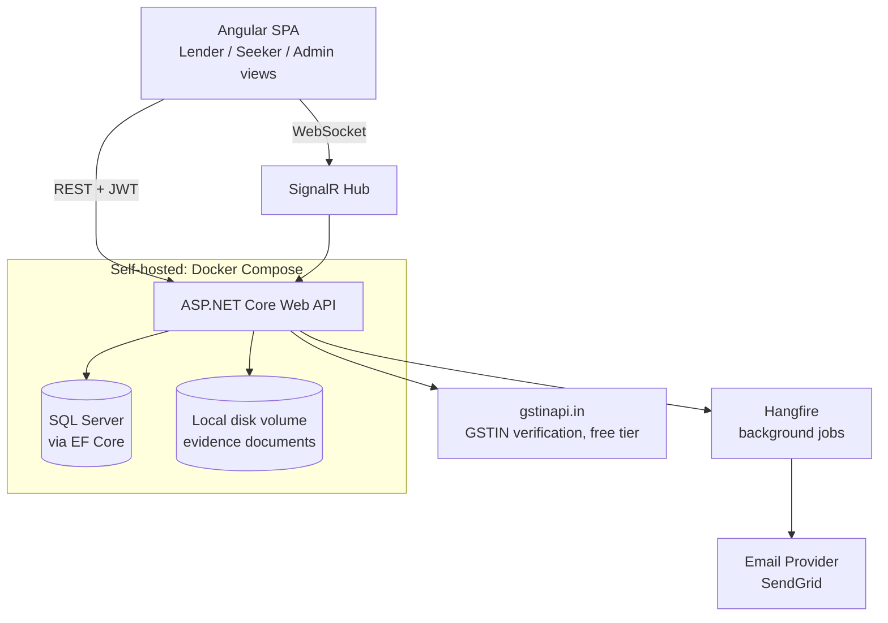

# Saakh — Tech Stack

Companion to `spec.md`. This document defines the technical stack and maps it to the functional requirements so an implementation agent can go from spec → working code without re-deriving architecture decisions.

## Architecture overview



Deployed as-is on a local machine for development, or on an Oracle Cloud Always Free VM if a public URL is needed — see Infrastructure below.

## Frontend

| Concern | Choice | Why |
| --- | --- | --- |
| Framework | Angular (latest LTS), TypeScript, standalone components | Specified by the team |
| UI kit | Angular Material | Free; covers forms, data tables (Opportunity/History), dialogs (raise ticket), multi-select filters out of the box |
| Charts | ng2-charts (Chart.js wrapper) or ngx-charts | Covers both spec charts: cumulative line (opened vs closed) and stacked bar (completed-clean vs halted) |
| State | Angular services + RxJS | App state is shallow (own deals, search results, one chat thread) — NgRx would be unjustified overhead for this scope |
| Routing | Angular Router with role-based route guards | Enforces Lender / Seeker / Admin view separation, and the Needs Approval/Pending tab-locking from the verification flow |
| Real-time client | `@microsoft/signalr` | Official SignalR JS client; drives live status banner, Interest notifications, chat |
| HTTP | Angular `HttpClient` + interceptor | Attaches JWT, handles refresh-token flow and 401 redirect |

## Backend

| Concern | Choice | Why |
| --- | --- | --- |
| Framework | ASP.NET Core Web API (C#) | Specified/preferred by the team |
| Auth | ASP.NET Core Identity + JWT (access + refresh tokens) | Built-in role support (Lender/Seeker/Admin); JWT fits a decoupled SPA + API shape |
| Real-time | SignalR | First-party, zero extra infra cost; fits verification-status push, Interest notifications, chat |
| Background jobs | Hangfire (free/OSS) | Sends the approval email async, retries GSTIN lookups on timeout, runs any scheduled cleanup |
| Validation | FluentValidation | Keeps ticket/profile form validation rules (e.g. GSTIN format) out of controllers |
| Mapping | AutoMapper | Entity ↔ DTO mapping for API responses |
| API docs | Swashbuckle (Swagger/OpenAPI) | Free, gives the coding agent and frontend a live contract to build against |

## Database

**SQL Server, via EF Core — confirmed choice.** The data model (Profile, Interest, Deal, Rating, Message, EvidenceDocument, Admin) is relational: foreign-keyed entities, transactional state transitions on Deal, a one-rating-per-party-per-deal constraint, and Admin's multi-filter queries (region, category, status, profile type) are all a natural fit for SQL WHERE/JOIN rather than document-store denormalization.

- ORM: EF Core, code-first migrations.
- Local/dev and self-hosted production: SQL Server container (`mcr.microsoft.com/mssql/server`) via Docker Compose — see Infrastructure below for why this is the primary plan rather than a managed cloud database.

### Entity → table mapping (from spec's Data Model section)

| Spec entity | Notes for schema |
| --- | --- |
| Profile | One row per role per business (per the "separate profiles per role" decision); `VerificationStatus` enum (Active/NeedsApproval/Pending/Rejected); `AvailabilityStatus` enum (active/inactive/suspended/removed); nullable `SuspensionEndDate` |
| Interest | FK to two Profiles; `Status` enum (sent/accepted/declined) |
| Deal | FK to Lender Profile + Seeker Profile; `State` enum (Open/Progress/Halted/Completed); separate `DealStateHistory` table for audit (who triggered each transition, when) |
| Message | FK to Deal or Interest thread + sender Profile. **Persisted indefinitely** — chat history is not pruned, since it's part of the deal's permanent record |
| Rating | FK to Deal + rater/rated Profile; unique constraint on (DealId, RaterProfileId) |
| EvidenceDocument | FK to Profile; blob reference (not the file itself) + reviewed_by (Admin), decision, rejection reason |
| Admin | Separate table, not a Profile; action log can be a simple `AdminActionLog` table (action type, target Profile, timestamp, notes) |

## File storage (evidence documents)

A Docker volume on the same host as the API (local disk) — kept consistent with the self-hosted infrastructure decision below, and avoids a second external account/provider. Hidden behind an `IFileStorageService` interface in the API, so it can be swapped for a managed provider later without touching controller code if the project ever needs to scale past a single host.

## Email

SendGrid free tier (100 emails/day, no card required) for real delivery during demos. Mailtrap as a safer default during development so test runs don't send real email to real inboxes. Hangfire triggers the send on Admin approval, using the subject/body already drafted in `spec.md`.

## External dependency: GSTIN verification

**Decided: [gstinapi.in](https://www.gstinapi.in/)** — genuinely free tier (100 GSTIN lookups/month, no credit card, credits don't expire), which comfortably covers a capstone's signup volume. Build against an `IGstinVerifier` interface either way: the real implementation calls this provider, and a mock implementation is used in automated runs so tests don't burn the monthly free quota. Re-verify their current terms at implementation time, since a smaller third-party API's free-tier terms can change — the interface is what protects you if they do.

Checked their docs directly: the live GSTIN-verify call always hits the real government network and spends a credit — the `test_mode` flag they offer is scoped to e-way bill/e-invoice endpoints, not the basic GSTIN lookup itself. So there is no dummy "always passes" GSTIN from the provider; a real registry lookup needs a real, currently-registered GSTIN. Their SDKs do validate the GSTIN checksum/format locally first (format: `^[0-9]{2}[A-Z]{5}[0-9]{4}[A-Z]{1}[1-9A-Z]{1}Z[0-9A-Z]{1}$`), so a mistyped number fails instantly without spending a credit — worth replicating that same regex check client-side in Angular too, so the form gives instant feedback before even calling the API.

**Where to get a real GSTIN that will pass, for your own live demo:** GSTIN is not confidential — it's a public tax-registration identifier meant to be checked by trading partners (that's the entire point of the registry), so this isn't a privacy concern the way using someone's PAN or Aadhaar would be. In order of preference:
1. If you or a teammate has a real registered business (even a small proprietorship), use that GSTIN — cleanest option, no third-party involved at all.
2. Otherwise, the [official GST portal's public taxpayer search](https://www.gst.gov.in/) ("Search Taxpayer" → "Search by GSTIN/UIN") lets you confirm any GSTIN is real and active before using it — pick a large, well-known company that already publishes its GSTIN on invoices or its own website for exactly this kind of verification.
3. Either way, you'll burn real credits from the 100/month free quota each time you test this live, so rehearse the demo with the mock `IGstinVerifier` first and only switch to the real provider for the actual run-through.

## Seed data (initial load)

Both dashboards need to look alive on first run, not empty — the Opportunity table, the two analytics charts, and the History tab all need data points to actually demonstrate the product.

- **Generator:** [Bogus](https://github.com/bchavez/Bogus) (free, MIT-licensed .NET library) for realistic fake names, locations, and business details.
- **Trigger:** a dedicated `dotnet run --seed` command (or a one-off Hangfire job gated to `Development`/`Demo` environments only) — never auto-runs in a real deployment.
- **What to seed:**
  - ~10–15 Lender profiles and ~15–20 Seeker profiles, spread across the category taxonomy (Money, Fruits, Dairy, Medicine, Industrial Equipment) and a handful of locations, so the location/capacity/rating filters have something to filter.
  - Most profiles `VerificationStatus = Active`; 2–3 left as `NeedsApproval`/`Pending` specifically so the Admin Verification Queue has something to demo.
  - ~20–30 historical Deals spread across the last several months, mostly `Completed` with a handful `Halted`, so both analytics charts (cumulative opened/closed, and clean-vs-escalated) show a real trend instead of a flat line.
  - Ratings on every Completed/Halted deal, mostly high with a few lower ones, so sorting/filtering by rating is demonstrable.
  - 1–2 Admin accounts.
- **Important shortcut for GSTIN:** seeded profiles are written **directly to the database** — they do not go through the signup endpoint, so they never call the live GSTIN API at all. Put any plausible-looking string in the `GSTIN` column for seed rows; it only needs to exist, not pass a live registry check. Reserve your real `gstinapi.in` free-tier credits for the 1–2 profiles you'll actually demo signing up live through the real validation flow (see below).

## Infrastructure

Given the hard requirement to run on $0, the plan below deliberately avoids the usual "managed cloud" recommendation, because the obvious options have real gotchas against a strict free requirement:
- **Azure App Service free (F1) tier** caps the API at 60 minutes of compute per day and sleeps the app — not viable for a persistently running API.
- **Azure SQL Database's free tier is free for 12 months only**, then bills automatically, and Azure has no built-in spend cap — a real risk for a "free" requirement, not a one-time gotcha.

**Primary plan — self-hosted via Docker Compose:**
- **Local dev:** Docker Compose — Angular (served via an nginx container), ASP.NET Core API container, SQL Server container, all in one `docker-compose.yml`. Zero cost, zero billing risk, and sufficient on its own if the capstone is demoed locally or via screen recording.
- **If a publicly reachable deployment is needed:** [Oracle Cloud's Always Free tier](https://www.oracle.com/cloud/free/) — genuinely perpetual (not a 12-month trial), includes always-free compute shapes (e.g. an Ampere A1 VM with multiple OCPUs/RAM) with no automatic billing beyond the free allowance. Run the same `docker-compose.yml` there unchanged. This is the one cloud option that actually matches "everything for free" without a time bomb.
- **CI:** GitHub Actions (free tier for public repos, and a generous free minutes allowance for private ones) — build + run tests on push.

### The compose file

Three services, one Docker network, two named volumes (SQL data, evidence documents). Secrets come from a git-ignored `.env`, never hardcoded into the images:

```yaml
services:
  web:
    build: ./frontend          # Angular build → served by nginx
    ports: ["80:80"]
    depends_on: [api]

  api:
    build: ./backend           # ASP.NET Core Web API
    ports: ["5000:5000"]
    environment:
      - ConnectionStrings__Default=Server=db;Database=Saakh;User=sa;Password=${DB_PASSWORD}
      - Gstin__ApiKey=${GSTIN_API_KEY}
    depends_on: [db]
    volumes:
      - evidence-docs:/app/storage/evidence

  db:
    image: mcr.microsoft.com/mssql/server:2022-latest
    environment:
      - ACCEPT_EULA=Y
      - SA_PASSWORD=${DB_PASSWORD}
    volumes:
      - sql-data:/var/opt/mssql

volumes:
  sql-data:
  evidence-docs:
```

- `frontend/Dockerfile` — two-stage build: a `node` stage runs `ng build --configuration production`, then the compiled output is copied into a lean `nginx:alpine` image.
- `backend/Dockerfile` — standard .NET two-stage build: `dotnet build`/`publish` in an SDK image, then run on the `aspnet` runtime image.
- **Running it:** `docker compose up -d` — identical command on a laptop or on the Oracle Cloud VM, since the compose file and images never change between environments.
- **Migrations and seed data** run as one-off exec commands against the already-running containers, not automatically on boot: `docker compose exec api dotnet ef database update`, then `docker compose exec api dotnet run --seed`.
- **Going public:** on the Oracle Cloud Always Free VM, install Docker + Compose, clone the repo, drop in the same `.env`, run the same `docker compose up -d`, and put Caddy or nginx in front of the `web` service for free TLS (Let's Encrypt) if a domain is pointed at it.

## Security notes

- JWT access tokens short-lived; refresh tokens rotated and stored httpOnly where the client allows it.
- Admin actions (warn/suspend/remove/verification approve-reject) must be logged with actor + timestamp — already required by the spec's Admin entity, enforced here via `AdminActionLog`.
- Rate-limit the GSTIN verification endpoint and the signup endpoint to prevent abuse of the real-time registry lookup.

## Open items for the implementing agent

No open decisions remain — all three prior items (GSTIN provider, hosting, message persistence) are resolved above. One thing worth a sanity check once development starts: confirm gstinapi.in's free-tier terms are still current before wiring the real `IGstinVerifier` implementation, since third-party free tiers can change without notice.
